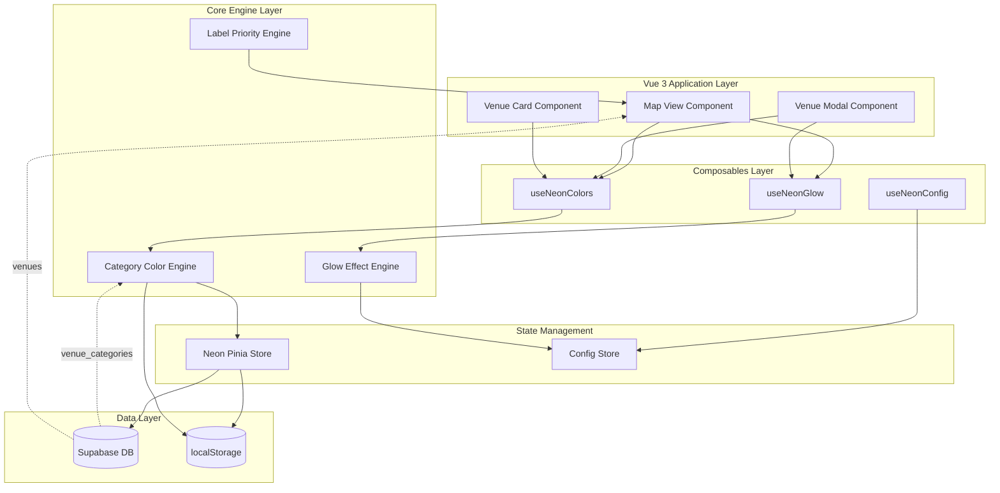

# Design Document: Neon Venue Signs System

## Overview

The Neon Venue Signs System is an enterprise-grade visual enhancement feature that transforms the VibeCity map interface with cyberpunk-inspired neon glow effects. The system provides dynamic, category-based color coding for venue labels and modal components while maintaining strict performance, accessibility, and user experience standards.

### Design Goals

1. **Visual Immersion**: Create an authentic neon aesthetic with multi-layered glow effects optimized for dark themes
2. **Performance**: Maintain 30+ FPS during all map interactions with GPU-accelerated rendering
3. **Accessibility**: Achieve WCAG 2.1 AA compliance with full keyboard navigation and reduced motion support
4. **Scalability**: Support unlimited venue categories with automatic color generation and conflict resolution
5. **Maintainability**: Implement using Vue 3 Composition API with TypeScript for type safety and reusability

### Key Technical Decisions

- **Color Generation**: HSL color space for perceptual uniformity and easy manipulation
- **Rendering Strategy**: CSS-based effects with GPU acceleration (transform, opacity, filter)
- **State Management**: Pinia stores for global neon configuration and category color mappings
- **Caching Strategy**: localStorage for persistent color assignments with 24-hour TTL
- **Label Prioritization**: Importance-based algorithm limiting visible labels to 50 for performance

## Architecture

### System Components



### Data Flow

1. **Initialization Flow**:
   - Application loads → Fetch venue categories from Supabase
   - Category Color Engine generates/retrieves color mappings
   - Colors cached in localStorage with timestamp
   - Pinia store hydrated with color mappings

2. **Rendering Flow**:
   - Map component receives venue data
   - Priority Engine filters to top 50 venues (if needed)
   - Each venue label retrieves category color from store
   - Glow Effect Engine applies CSS with appropriate intensity
   - GPU renders multi-layered shadows

3. **Interaction Flow**:
   - User hovers/clicks venue label
   - Event triggers intensity state change
   - CSS transitions animate glow intensity
   - Respects prefers-reduced-motion setting

### Technology Stack Integration

- **Vue 3**: Composition API with `<script setup>` syntax
- **TypeScript**: Full type safety for all components and composables
- **Pinia**: Reactive state management for color mappings and configuration
- **Tailwind CSS**: Utility classes for base styling
- **Custom CSS**: Dedicated `neon-effects.css` for glow effects
- **Supabase**: PostgreSQL database for venue and category data
- **localStorage**: Client-side caching for color persistence

## Components and Interfaces

### 1. Category Color Engine

**Purpose**: Generate and manage unique neon colors for each venue category

**Core Algorithm**:

```typescript
interface ColorGenerationConfig {
  minHueDifference: number;      // 30 degrees
  minDeltaE: number;              // 30 (perceptual difference)
  saturationRange: [number, number]; // [70, 100]
  lightnessRange: [number, number];  // [50, 70]
  excludedHueRanges: [number, number][]; // [[0, 20]] (red spectrum)
}

interface CategoryColor {
  categoryId: string;
  categoryName: string;
  hsl: { h: number; s: number; l: number };
  hex: string;
  rgb: { r: number; g: number; b: number };
  generatedAt: number;
}
```

**Color Generation Strategy**:

1. **Golden Ratio Distribution**: Use golden angle (137.5°) to distribute hues evenly
2. **Perceptual Validation**: Calculate ΔE (CIE76) between all color pairs
3. **Conflict Resolution**: If ΔE < 30, adjust hue by +15° and revalidate
4. **Saturation Jitter**: Add ±5% random variation to prevent monotony
5. **Lightness Optimization**: Adjust based on hue (yellows lighter, blues darker)

**Caching Strategy**:

```typescript
interface ColorCache {
  version: string;              // "1.0.0"
  generatedAt: number;          // Unix timestamp
  expiresAt: number;            // generatedAt + 24 hours
  categories: CategoryColor[];
  checksum: string;             // MD5 of category IDs
}
```

- Cache invalidation: 24-hour TTL or category list change
- Checksum validation: Compare category IDs to detect database changes
- Fallback: Predefined palette if generation fails

### 2. Glow Effect Engine

**Purpose**: Apply and manage multi-layered CSS glow effects

**Intensity Levels**:

```typescript
enum GlowIntensity {
  DEFAULT = 1.0,   // Base steady glow
  HOVER = 1.3,     // +30% on hover
  ACTIVE = 1.6,    // +60% on click/active
  HIGH_CONTRAST = 1.4 // +40% for accessibility
}

interface GlowConfig {
  baseBlur: number;        // 12px
  baseSpread: number;      // 4px
  layerCount: number;      // 3 layers
  intensityMultiplier: number;
  transitionDuration: number; // 200ms
  transitionEasing: string;   // cubic-bezier(0.4, 0.0, 0.2, 1)
}
```

**Multi-Layer Shadow Implementation**:

```css
/* Layer 1: Inner glow (tight, bright) */
text-shadow: 
  0 0 4px color,
  0 0 8px color,
  0 0 12px color;

/* Layer 2: Middle glow (medium spread) */
box-shadow:
  0 0 8px color,
  0 0 16px color,
  0 0 24px color;

/* Layer 3: Outer glow (wide, soft) */
box-shadow:
  inset 0 0 20px color,
  0 0 40px color;
```

**GPU Acceleration Strategy**:

- Use `will-change: transform, opacity` for animated elements
- Avoid animating `box-shadow` directly (use opacity on pseudo-elements)
- Leverage `transform: translateZ(0)` to force GPU layer
- Limit simultaneous animations to 50 elements

### 3. Map Label Component

**Purpose**: Render venue names as neon signs on the map

**Component Interface**:

```typescript
interface MapLabelProps {
  venue: {
    id: string;
    name: string;
    categoryId: string;
    lat: number;
    lng: number;
    importanceScore: number;
  };
  zoomLevel: number;
  isVisible: boolean;
}

interface MapLabelEmits {
  (e: 'click', venueId: string): void;
  (e: 'hover', venueId: string): void;
}
```

**Positioning Strategy**:

- Calculate pixel position from lat/lng using map projection
- Offset label 20px above marker center
- Apply CSS transform for smooth panning (GPU-accelerated)
- Use `position: absolute` with `pointer-events: auto`

**Visibility Rules**:

- Hide if zoom level < 13
- Hide if outside viewport bounds (with 100px buffer)
- Hide if importance score below threshold (when > 50 visible)
- Fade in with 50ms stagger on initial render

### 4. Neon Modal Component

**Purpose**: Display venue details with neon-styled borders and headers

**Component Structure**:

```typescript
interface NeonModalProps {
  venue: Venue;
  isOpen: boolean;
  categoryColor: string;
}

interface NeonModalSlots {
  header: () => VNode;
  content: () => VNode;
  footer: () => VNode;
}
```

**Styling Strategy**:

- Border: 2px solid with multi-layer box-shadow glow
- Header: Neon text with category color
- Background: `rgba(10, 10, 15, 0.92)` for semi-transparency
- Backdrop: `backdrop-filter: blur(8px)` for depth
- Animation: Fade-in + scale (0.95 → 1.0) over 250ms

### 5. Label Priority Engine

**Purpose**: Limit visible labels to 50 based on importance

**Priority Algorithm**:

```typescript
interface VenuePriority {
  venueId: string;
  score: number;
}

function calculatePriorityScore(venue: Venue, userLocation: LatLng): number {
  const distanceScore = 1 / (1 + distanceInKm(venue, userLocation));
  const importanceScore = venue.importanceScore / 100;
  const categoryBoost = getCategoryBoost(venue.categoryId);
  
  return (distanceScore * 0.4) + (importanceScore * 0.4) + (categoryBoost * 0.2);
}
```

**Scoring Factors**:

- **Distance** (40%): Closer venues prioritized
- **Importance** (40%): Database-defined importance score
- **Category Boost** (20%): Popular categories (restaurants, bars) get +0.2

**Dynamic Updates**:

- Recalculate on map pan/zoom
- Debounce recalculation (300ms)
- Smooth fade transitions when labels swap

### 6. Vue Composables

#### useNeonColors

```typescript
export function useNeonColors() {
  const neonStore = useNeonStore();
  
  const getCategoryColor = (categoryId: string): string => {
    return neonStore.colorMap.get(categoryId) || neonStore.defaultColor;
  };
  
  const refreshColors = async (): Promise<void> => {
    await neonStore.fetchAndGenerateColors();
  };
  
  const previewAllColors = (): CategoryColor[] => {
    return Array.from(neonStore.colorMap.values());
  };
  
  return {
    getCategoryColor,
    refreshColors,
    previewAllColors,
    isLoading: computed(() => neonStore.isLoading),
    error: computed(() => neonStore.error)
  };
}
```

#### useNeonGlow

```typescript
export function useNeonGlow(color: Ref<string>) {
  const intensity = ref<GlowIntensity>(GlowIntensity.DEFAULT);
  const prefersReducedMotion = usePreferredReducedMotion();
  
  const glowStyle = computed(() => ({
    '--neon-color': color.value,
    '--neon-intensity': intensity.value,
    '--neon-transition': prefersReducedMotion.value ? 'none' : '200ms ease-out'
  }));
  
  const setIntensity = (level: GlowIntensity) => {
    intensity.value = level;
  };
  
  return {
    glowStyle,
    setIntensity,
    onHover: () => setIntensity(GlowIntensity.HOVER),
    onLeave: () => setIntensity(GlowIntensity.DEFAULT),
    onActive: () => setIntensity(GlowIntensity.ACTIVE)
  };
}
```

#### useNeonConfig

```typescript
export function useNeonConfig() {
  const configStore = useConfigStore();
  
  const config = computed(() => configStore.neonConfig);
  
  const updateConfig = (partial: Partial<NeonConfig>): void => {
    configStore.updateNeonConfig(partial);
  };
  
  const resetToDefaults = (): void => {
    configStore.resetNeonConfig();
  };
  
  return {
    config,
    updateConfig,
    resetToDefaults,
    isEnabled: computed(() => config.value.enabled)
  };
}
```

## Data Models

### Database Schema

```sql
-- Existing tables (reference only)
CREATE TABLE venue_categories (
  id UUID PRIMARY KEY DEFAULT uuid_generate_v4(),
  name TEXT NOT NULL UNIQUE,
  slug TEXT NOT NULL UNIQUE,
  icon TEXT,
  created_at TIMESTAMPTZ DEFAULT NOW()
);

CREATE TABLE venues (
  id UUID PRIMARY KEY DEFAULT uuid_generate_v4(),
  name TEXT NOT NULL,
  category_id UUID REFERENCES venue_categories(id),
  location GEOGRAPHY(POINT, 4326) NOT NULL,
  importance_score INTEGER DEFAULT 50 CHECK (importance_score BETWEEN 0 AND 100),
  created_at TIMESTAMPTZ DEFAULT NOW()
);

-- New index for performance
CREATE INDEX idx_venues_category_importance 
ON venues(category_id, importance_score DESC);
```

### TypeScript Interfaces

```typescript
// Core domain models
interface Venue {
  id: string;
  name: string;
  categoryId: string;
  location: {
    lat: number;
    lng: number;
  };
  importanceScore: number;
  createdAt: string;
}

interface VenueCategory {
  id: string;
  name: string;
  slug: string;
  icon?: string;
  createdAt: string;
}

// Neon system models
interface NeonColor {
  hsl: HSLColor;
  hex: string;
  rgb: RGBColor;
}

interface HSLColor {
  h: number; // 0-360
  s: number; // 0-100
  l: number; // 0-100
}

interface RGBColor {
  r: number; // 0-255
  g: number; // 0-255
  b: number; // 0-255
}

interface CategoryColorMapping {
  categoryId: string;
  color: NeonColor;
  generatedAt: number;
}

// Configuration models
interface NeonConfig {
  enabled: boolean;
  glow: {
    baseBlur: number;
    baseSpread: number;
    layerCount: number;
    transitionDuration: number;
    transitionEasing: string;
  };
  colors: {
    minHueDifference: number;
    minDeltaE: number;
    saturationRange: [number, number];
    lightnessRange: [number, number];
    excludedHueRanges: [number, number][];
  };
  labels: {
    maxVisible: number;
    minZoomLevel: number;
    fadeInStagger: number;
  };
  performance: {
    enableGPUAcceleration: boolean;
    targetFPS: number;
    debounceDelay: number;
  };
}

// Pinia store state
interface NeonStoreState {
  colorMap: Map<string, NeonColor>;
  categories: VenueCategory[];
  config: NeonConfig;
  isLoading: boolean;
  error: string | null;
  lastFetchedAt: number | null;
}

// Component props and emits
interface MapLabelComponentProps {
  venue: Venue;
  zoomLevel: number;
  isVisible: boolean;
  color: string;
}

interface NeonModalComponentProps {
  venue: Venue;
  isOpen: boolean;
  color: string;
}

interface NeonCardComponentProps {
  venue: Venue;
  color: string;
  variant: 'compact' | 'detailed';
}
```

### localStorage Schema

```typescript
interface NeonLocalStorageData {
  colorCache: {
    version: string;
    generatedAt: number;
    expiresAt: number;
    categories: Array<{
      categoryId: string;
      categoryName: string;
      color: NeonColor;
    }>;
    checksum: string;
  };
  userPreferences: {
    reducedMotion: boolean;
    highContrast: boolean;
  };
}

// Storage keys
const STORAGE_KEYS = {
  COLOR_CACHE: 'vibecity:neon:color-cache',
  USER_PREFS: 'vibecity:neon:preferences'
} as const;
```

### API Response Types

```typescript
// Supabase query response
interface FetchCategoriesResponse {
  data: VenueCategory[] | null;
  error: PostgrestError | null;
}

interface FetchVenuesResponse {
  data: Venue[] | null;
  error: PostgrestError | null;
}

// Color generation result
interface ColorGenerationResult {
  success: boolean;
  colors: Map<string, NeonColor>;
  conflicts: Array<{
    categoryId1: string;
    categoryId2: string;
    deltaE: number;
  }>;
  fallbacksUsed: string[];
}
```


## Correctness Properties

*A property is a characteristic or behavior that should hold true across all valid executions of a system—essentially, a formal statement about what the system should do. Properties serve as the bridge between human-readable specifications and machine-verifiable correctness guarantees.*

### Property 1: Venue Label Rendering with Glow

*For any* venue visible on the map, the Map_Label component should render the venue name with neon glow effects applied (text-shadow CSS property present).

**Validates: Requirements 1.1**

### Property 2: Label Positioning Above Marker

*For any* venue at any map location, the Map_Label should be positioned above the venue marker with a consistent vertical offset.

**Validates: Requirements 1.2**

### Property 3: Category Color Assignment

*For any* venue with an assigned category, the Map_Label should use the color returned by the Category_Color_Engine for that category.

**Validates: Requirements 1.3**

### Property 4: Zoom Level Visibility Threshold

*For any* map zoom level, Map_Labels should be visible if and only if the zoom level is greater than or equal to 13.

**Validates: Requirements 1.4**

### Property 5: Text Shadow Glow Presence

*For any* rendered Map_Label, the computed CSS styles should include text-shadow properties that create the glow effect.

**Validates: Requirements 1.5**

### Property 6: Minimum Contrast Ratio

*For any* generated neon color, the contrast ratio against the dark map background should be at least 4.5:1 to ensure readability.

**Validates: Requirements 1.6**

### Property 7: Unique Category Colors

*For any* two different venue categories, the assigned neon colors should have different hex values (ensuring uniqueness).

**Validates: Requirements 2.1**

### Property 8: Complete Category Coverage

*For any* venue category in the database, the Category_Color_Engine should have a corresponding color mapping entry.

**Validates: Requirements 2.2, 9.2**

### Property 9: HSL Color Constraints

*For any* generated neon color, the HSL values should satisfy: saturation ∈ [70, 100] and lightness ∈ [50, 70].

**Validates: Requirements 2.3, 7.1, 11.1**

### Property 10: Minimum Color Difference

*For any* pair of category colors, the perceptual color difference (ΔE using CIE76) should be at least 30 to ensure distinguishability.

**Validates: Requirements 2.4, 11.4**

### Property 11: Color Persistence Round Trip

*For any* set of generated category colors, storing them to localStorage and then retrieving them should produce the same color values (serialization round trip).

**Validates: Requirements 2.5**

### Property 12: Dynamic Category Color Generation

*For any* new category added to the system, the Category_Color_Engine should generate a color that doesn't conflict with existing colors (meeting minimum ΔE requirement).

**Validates: Requirements 2.6**

### Property 13: Modal Border Color Matching

*For any* Neon_Modal displaying a venue, the border glow color should match the venue's category color from the Category_Color_Engine.

**Validates: Requirements 3.1**

### Property 14: Modal Header Neon Styling

*For any* Neon_Modal, the header should display the venue name with neon text styling (text-shadow applied).

**Validates: Requirements 3.2**

### Property 15: Modal Box Shadow Application

*For any* Neon_Modal, the computed CSS styles should include box-shadow properties using the category color.

**Validates: Requirements 3.3**

### Property 16: Modal Background Transparency

*For any* Neon_Modal, the background color should use rgba format with alpha value between 0.85 and 0.95.

**Validates: Requirements 3.4, 7.5**

### Property 17: Modal Glow Intensity Increase

*For any* Neon_Modal in the opened state, the glow intensity should be 1.5x (50% increase) compared to the default state.

**Validates: Requirements 3.5**

### Property 18: Default Steady Glow Intensity

*For any* Map_Label in the default state (no interaction), the glow intensity should equal the base intensity value (1.0).

**Validates: Requirements 4.1**

### Property 19: Hover Intensity Increase

*For any* Map_Label receiving a hover event, the glow intensity should increase to 1.3x (30% increase) the base intensity.

**Validates: Requirements 4.2**

### Property 20: Click Intensity Increase

*For any* Map_Label receiving a click event, the glow intensity should increase to 1.6x (60% increase) the base intensity.

**Validates: Requirements 4.3**

### Property 21: Hover Exit Intensity Reset

*For any* Map_Label when the cursor leaves, the glow intensity should return to the base intensity (1.0).

**Validates: Requirements 4.4**

### Property 22: Transition Easing Function

*For any* interactive glow transition, the CSS transition-timing-function should be cubic-bezier(0.4, 0.0, 0.2, 1).

**Validates: Requirements 4.5, 10.3**

### Property 23: Reduced Motion Respect

*For any* user with prefers-reduced-motion enabled, all glow transitions should be disabled (transition: none).

**Validates: Requirements 4.6, 6.6**

### Property 24: GPU-Accelerated Properties

*For any* element with glow effects, the CSS should use GPU-accelerated properties (transform, opacity, will-change).

**Validates: Requirements 5.1**

### Property 25: Maximum Visible Labels Limit

*For any* map state, the number of simultaneously rendered Map_Labels should not exceed 50.

**Validates: Requirements 5.2**

### Property 26: Importance-Based Prioritization

*For any* map state with more than 50 visible venues, the rendered labels should be the top 50 venues by priority score.

**Validates: Requirements 5.3**

### Property 27: Color Cache Initialization

*For any* application initialization, all category colors should be computed and cached before the first render.

**Validates: Requirements 5.6**

### Property 28: WCAG Compliance

*For any* text element in the Neon_Sign_System, the contrast ratio and font size should meet WCAG 2.1 AA standards.

**Validates: Requirements 6.1**

### Property 29: Responsive Font Scaling

*For any* viewport width below 768px, Map_Label font size should be at least 14px.

**Validates: Requirements 6.2**

### Property 30: Keyboard Navigation Support

*For any* Neon_Modal, all interactive elements should be keyboard accessible with visible focus indicators.

**Validates: Requirements 6.3**

### Property 31: High Contrast Mode Intensity

*For any* user with high contrast mode enabled, the glow intensity should increase by 1.4x (40% increase).

**Validates: Requirements 6.4**

### Property 32: Screen Reader Accessibility

*For any* Map_Label and Neon_Modal, appropriate ARIA labels or alt text should be present for screen readers.

**Validates: Requirements 6.5**

### Property 33: Multi-Layer Shadow Depth

*For any* glow effect, the CSS should include multiple shadow layers (at least 3) to create depth.

**Validates: Requirements 7.2**

### Property 34: Warm White Usage

*For any* color in the system, pure white (RGB 255, 255, 255) should not be used; warm whites should be used instead.

**Validates: Requirements 7.3**

### Property 35: Label Dark Outline

*For any* Map_Label, a subtle dark outline (text-stroke or similar) should be present to prevent color bleeding.

**Validates: Requirements 7.4**

### Property 36: Minimum Brightness Difference

*For any* neon color, the perceived brightness difference from the dark background should be at least 125.

**Validates: Requirements 7.6**

### Property 37: Reactive Composable

*For any* color accessed through useNeonColors composable, changes to the color map should reactively update dependent components.

**Validates: Requirements 8.4**

### Property 38: Category Data Initialization

*For any* application startup, the Category_Color_Engine should fetch all venue categories from the database.

**Validates: Requirements 9.1**

### Property 39: localStorage Cache with Expiration

*For any* color mapping cached in localStorage, an expiration timestamp (24 hours from creation) should be stored.

**Validates: Requirements 9.5**

### Property 40: Cache Invalidation on Category Change

*For any* change to the venue_categories table (detected via checksum), the color cache should be invalidated and regenerated.

**Validates: Requirements 9.6**

### Property 41: CSS Transition Presence

*For any* glow intensity change, CSS transitions should be applied (unless reduced motion is enabled).

**Validates: Requirements 10.1**

### Property 42: Transition Duration Range

*For any* interactive glow transition, the duration should be between 150ms and 300ms.

**Validates: Requirements 10.2**

### Property 43: Staggered Label Fade-In

*For any* group of Map_Labels appearing simultaneously, each label's animation delay should be staggered by 50ms increments.

**Validates: Requirements 10.4**

### Property 44: Modal Opening Animation

*For any* Neon_Modal opening, the animation should include both fade-in (opacity) and scale-up (transform) over 250ms.

**Validates: Requirements 10.5**

### Property 45: Red Spectrum Exclusion

*For any* generated category color, the hue value should not be in the range [0, 20] degrees (red spectrum excluded).

**Validates: Requirements 11.2**

### Property 46: Color Spectrum Diversity

*For any* set of generated colors, colors should span multiple hue ranges including cyan, magenta, yellow, and green spectrums.

**Validates: Requirements 11.3**

### Property 47: Blur Radius Range

*For any* glow effect, the blur radius should be between 8px and 20px.

**Validates: Requirements 11.5**

### Property 48: Manual Color Override Support

*For any* category with a manual color override in configuration, the override color should be used instead of the generated color.

**Validates: Requirements 13.2**

### Property 49: Feature Flag Toggle

*For any* system state where the neon feature flag is disabled, no neon effects should be applied to any components.

**Validates: Requirements 13.3**

### Property 50: Configuration Validation

*For any* configuration object provided, all values should be validated against their expected types and ranges on startup.

**Validates: Requirements 13.5**

### Property 51: Error Logging

*For any* error encountered in the Neon_Sign_System, a descriptive error message should be logged to the console.

**Validates: Requirements 12.5**

### Property 52: Vendor Prefix Presence

*For any* CSS property requiring vendor prefixes for browser compatibility, the appropriate prefixes should be present.

**Validates: Requirements 15.2**

### Property 53: Browser Capability Detection

*For any* application initialization, browser capabilities (GPU support, CSS features) should be detected and stored.

**Validates: Requirements 15.4**


### Example 1: Administrator Color Preview

When an administrator requests to preview all category colors, the system should return a complete list of all categories with their assigned neon colors displayed visually.

**Validates: Requirements 11.6**

### Example 2: Fallback Color Palette on Load Failure

When the Category_Color_Engine fails to load category data from the database, the system should use a predefined fallback color palette with at least 10 distinct neon colors.

**Validates: Requirements 12.1**

### Example 3: CSS Custom Properties Fallback

When CSS custom properties are not supported by the browser, the system should fall back to inline styles for applying neon colors.

**Validates: Requirements 12.3, 15.3**

### Example 4: GPU Acceleration Unavailable

When GPU acceleration is unavailable or disabled, the system should disable complex multi-layer glow effects and use simple border styling instead.

**Validates: Requirements 12.4**

### Example 5: Critical Error Graceful Degradation

When the neon system encounters a critical error (e.g., color engine crash), Map_Labels should still render venue names without styling rather than failing completely.

**Validates: Requirements 12.6**

### Example 6: Configuration Object Exposure

When accessing the neon configuration, the system should expose an object with adjustable parameters including glow intensity, blur radius, and transition duration.

**Validates: Requirements 13.1**

### Example 7: Invalid Configuration Handling

When invalid configuration values are provided (e.g., negative blur radius), the system should use default values and log a warning to the console.

**Validates: Requirements 13.4**

### Edge Case 1: Venue Without Category

When a venue has no category assigned (null or undefined categoryId), the system should use the default neutral neon color (HSL: 0, 0%, 80%).

**Validates: Requirements 9.4, 12.2**


## Error Handling

### Error Categories

The Neon Venue Signs System implements comprehensive error handling across four categories:

1. **Data Loading Errors**: Database connection failures, missing tables, invalid data
2. **Color Generation Errors**: Algorithm failures, constraint violations, cache corruption
3. **Rendering Errors**: CSS application failures, DOM manipulation errors, browser incompatibilities
4. **Configuration Errors**: Invalid config values, missing required settings, type mismatches

### Error Handling Strategies

#### 1. Data Loading Errors

**Scenario**: Supabase connection fails or venue_categories table is inaccessible

**Strategy**:
- Catch database errors in try-catch blocks
- Log detailed error with context to console
- Use predefined fallback color palette (10 colors)
- Set error state in Pinia store for UI notification
- Retry mechanism: 3 attempts with exponential backoff (1s, 2s, 4s)

**Fallback Color Palette**:
```typescript
const FALLBACK_COLORS: NeonColor[] = [
  { hsl: { h: 180, s: 85, l: 60 }, hex: '#33E0E0' }, // Cyan
  { hsl: { h: 280, s: 80, l: 65 }, hex: '#B366FF' }, // Magenta
  { hsl: { h: 60, s: 90, l: 60 }, hex: '#F0F033' },  // Yellow
  { hsl: { h: 120, s: 75, l: 55 }, hex: '#40E640' }, // Green
  { hsl: { h: 200, s: 85, l: 60 }, hex: '#33B3E0' }, // Light Blue
  { hsl: { h: 320, s: 80, l: 65 }, hex: '#FF66CC' }, // Pink
  { hsl: { h: 40, s: 90, l: 60 }, hex: '#F0C033' },  // Orange
  { hsl: { h: 160, s: 75, l: 55 }, hex: '#40E6B3' }, // Teal
  { hsl: { h: 260, s: 80, l: 65 }, hex: '#9966FF' }, // Purple
  { hsl: { h: 80, s: 85, l: 60 }, hex: '#B3E033' }   // Lime
];
```

#### 2. Color Generation Errors

**Scenario**: Algorithm fails to generate valid colors meeting all constraints

**Strategy**:
- Validate constraints before generation
- If ΔE < 30 after 10 adjustment attempts, log warning and accept best result
- If generation completely fails, use fallback palette
- Cache validation: verify checksum before using cached colors
- Corrupted cache: delete and regenerate

**Validation Checks**:
```typescript
function validateGeneratedColor(color: NeonColor): ValidationResult {
  const errors: string[] = [];
  
  if (color.hsl.s < 70 || color.hsl.s > 100) {
    errors.push(`Saturation ${color.hsl.s} outside range [70, 100]`);
  }
  
  if (color.hsl.l < 50 || color.hsl.l > 70) {
    errors.push(`Lightness ${color.hsl.l} outside range [50, 70]`);
  }
  
  if (color.hsl.h >= 0 && color.hsl.h <= 20) {
    errors.push(`Hue ${color.hsl.h} in excluded red spectrum [0, 20]`);
  }
  
  return { valid: errors.length === 0, errors };
}
```

#### 3. Rendering Errors

**Scenario**: CSS fails to apply, DOM elements missing, browser incompatibility

**Strategy**:
- Feature detection on initialization
- Graceful degradation: disable effects if GPU unavailable
- CSS custom properties fallback to inline styles
- Missing DOM elements: log error but don't crash
- Use defensive programming with optional chaining

**Browser Capability Detection**:
```typescript
interface BrowserCapabilities {
  supportsGPUAcceleration: boolean;
  supportsCSSCustomProperties: boolean;
  supportsCSSFilters: boolean;
  supportsBackdropFilter: boolean;
}

function detectCapabilities(): BrowserCapabilities {
  return {
    supportsGPUAcceleration: 'transform' in document.body.style,
    supportsCSSCustomProperties: CSS.supports('--test', '0'),
    supportsCSSFilters: CSS.supports('filter', 'blur(1px)'),
    supportsBackdropFilter: CSS.supports('backdrop-filter', 'blur(1px)')
  };
}
```

#### 4. Configuration Errors

**Scenario**: Invalid config values provided by administrator

**Strategy**:
- Validate all config on startup using Zod schema
- Replace invalid values with defaults
- Log warnings for each invalid value
- Provide helpful error messages with expected ranges

**Configuration Validation**:
```typescript
import { z } from 'zod';

const NeonConfigSchema = z.object({
  enabled: z.boolean(),
  glow: z.object({
    baseBlur: z.number().min(4).max(30),
    baseSpread: z.number().min(0).max(10),
    layerCount: z.number().int().min(1).max(5),
    transitionDuration: z.number().min(50).max(500),
    transitionEasing: z.string()
  }),
  colors: z.object({
    minHueDifference: z.number().min(15).max(60),
    minDeltaE: z.number().min(20).max(50),
    saturationRange: z.tuple([z.number().min(50), z.number().max(100)]),
    lightnessRange: z.tuple([z.number().min(30), z.number().max(80)])
  }),
  labels: z.object({
    maxVisible: z.number().int().min(10).max(100),
    minZoomLevel: z.number().min(10).max(18),
    fadeInStagger: z.number().min(0).max(200)
  })
});
```

### Error Recovery Mechanisms

1. **Automatic Retry**: Database operations retry 3 times with backoff
2. **Cache Fallback**: Use cached data if fresh fetch fails
3. **Graceful Degradation**: Disable effects rather than crash
4. **User Notification**: Show non-intrusive toast for critical errors
5. **Telemetry**: Log errors to monitoring service (if configured)

### Error Logging Format

```typescript
interface ErrorLog {
  timestamp: number;
  component: string;
  severity: 'error' | 'warning' | 'info';
  message: string;
  context: Record<string, any>;
  stack?: string;
}

function logError(error: Error, context: Record<string, any>): void {
  const log: ErrorLog = {
    timestamp: Date.now(),
    component: 'NeonSignSystem',
    severity: 'error',
    message: error.message,
    context,
    stack: error.stack
  };
  
  console.error('[Neon System Error]', log);
  
  // Send to monitoring service if available
  if (window.analytics) {
    window.analytics.track('neon_system_error', log);
  }
}
```


## Testing Strategy

### Dual Testing Approach

The Neon Venue Signs System requires both unit tests and property-based tests for comprehensive coverage:

- **Unit Tests**: Verify specific examples, edge cases, error conditions, and integration points
- **Property-Based Tests**: Verify universal properties across all inputs using randomized testing

Both approaches are complementary and necessary. Unit tests catch concrete bugs in specific scenarios, while property-based tests verify general correctness across the input space.

### Property-Based Testing Configuration

**Library Selection**: **fast-check** (JavaScript/TypeScript property-based testing library)

**Rationale**: 
- Native TypeScript support with excellent type inference
- Mature library with extensive arbitrary generators
- Integrates seamlessly with Vitest/Jest
- Excellent shrinking capabilities for minimal failing examples

**Configuration**:
```typescript
// vitest.config.ts
export default defineConfig({
  test: {
    // Property tests need more iterations
    timeout: 10000,
    // Enable parallel execution
    threads: true
  }
});
```

**Test Tagging Convention**:
```typescript
// Each property test must reference its design document property
describe('Neon Sign System - Property Tests', () => {
  it('Property 1: Venue Label Rendering with Glow - Feature: neon-venue-signs', () => {
    fc.assert(
      fc.property(
        fc.record({
          id: fc.uuid(),
          name: fc.string({ minLength: 1, maxLength: 100 }),
          categoryId: fc.uuid(),
          lat: fc.double({ min: -90, max: 90 }),
          lng: fc.double({ min: -180, max: 180 }),
          importanceScore: fc.integer({ min: 0, max: 100 })
        }),
        (venue) => {
          const label = renderMapLabel(venue);
          const styles = getComputedStyle(label);
          return styles.textShadow !== 'none';
        }
      ),
      { numRuns: 100 }
    );
  });
});
```

### Test Organization

```
tests/
├── unit/
│   ├── color-engine.test.ts          # Category Color Engine unit tests
│   ├── glow-engine.test.ts           # Glow Effect Engine unit tests
│   ├── priority-engine.test.ts       # Label Priority Engine unit tests
│   ├── composables/
│   │   ├── useNeonColors.test.ts
│   │   ├── useNeonGlow.test.ts
│   │   └── useNeonConfig.test.ts
│   └── components/
│       ├── MapLabel.test.ts
│       ├── NeonModal.test.ts
│       └── NeonCard.test.ts
├── property/
│   ├── color-generation.property.test.ts    # Properties 7-12, 45-46
│   ├── rendering.property.test.ts           # Properties 1-6, 13-17
│   ├── interactions.property.test.ts        # Properties 18-23
│   ├── performance.property.test.ts         # Properties 24-27
│   ├── accessibility.property.test.ts       # Properties 28-32
│   └── configuration.property.test.ts       # Properties 48-50
├── integration/
│   ├── database-integration.test.ts   # Supabase integration
│   ├── cache-integration.test.ts      # localStorage integration
│   └── store-integration.test.ts      # Pinia store integration
├── visual/
│   ├── glow-effects.visual.test.ts    # Visual regression tests
│   └── snapshots/                     # Stored visual snapshots
└── e2e/
    ├── map-interaction.e2e.test.ts    # End-to-end map tests
    └── modal-interaction.e2e.test.ts  # End-to-end modal tests
```

### Property-Based Test Examples

#### Example 1: Color Generation Properties

```typescript
import fc from 'fast-check';
import { describe, it, expect } from 'vitest';
import { CategoryColorEngine } from '@/lib/neon/color-engine';

describe('Category Color Engine - Property Tests', () => {
  const engine = new CategoryColorEngine();
  
  it('Property 9: HSL Color Constraints - Feature: neon-venue-signs', () => {
    fc.assert(
      fc.property(
        fc.array(fc.record({
          id: fc.uuid(),
          name: fc.string({ minLength: 1 }),
          slug: fc.string({ minLength: 1 })
        }), { minLength: 1, maxLength: 50 }),
        (categories) => {
          const colors = engine.generateColors(categories);
          
          return Array.from(colors.values()).every(color => 
            color.hsl.s >= 70 && color.hsl.s <= 100 &&
            color.hsl.l >= 50 && color.hsl.l <= 70
          );
        }
      ),
      { numRuns: 100 }
    );
  });
  
  it('Property 10: Minimum Color Difference - Feature: neon-venue-signs', () => {
    fc.assert(
      fc.property(
        fc.array(fc.record({
          id: fc.uuid(),
          name: fc.string({ minLength: 1 }),
          slug: fc.string({ minLength: 1 })
        }), { minLength: 2, maxLength: 20 }),
        (categories) => {
          const colors = engine.generateColors(categories);
          const colorArray = Array.from(colors.values());
          
          // Check all pairs
          for (let i = 0; i < colorArray.length; i++) {
            for (let j = i + 1; j < colorArray.length; j++) {
              const deltaE = calculateDeltaE(colorArray[i], colorArray[j]);
              if (deltaE < 30) return false;
            }
          }
          return true;
        }
      ),
      { numRuns: 100 }
    );
  });
  
  it('Property 11: Color Persistence Round Trip - Feature: neon-venue-signs', () => {
    fc.assert(
      fc.property(
        fc.array(fc.record({
          id: fc.uuid(),
          name: fc.string({ minLength: 1 }),
          slug: fc.string({ minLength: 1 })
        }), { minLength: 1, maxLength: 20 }),
        (categories) => {
          const originalColors = engine.generateColors(categories);
          
          // Serialize to localStorage format
          const serialized = engine.serializeColors(originalColors);
          
          // Deserialize back
          const deserialized = engine.deserializeColors(serialized);
          
          // Compare
          return Array.from(originalColors.entries()).every(([id, color]) => {
            const restored = deserialized.get(id);
            return restored && 
              restored.hex === color.hex &&
              restored.hsl.h === color.hsl.h &&
              restored.hsl.s === color.hsl.s &&
              restored.hsl.l === color.hsl.l;
          });
        }
      ),
      { numRuns: 100 }
    );
  });
});
```

#### Example 2: Rendering Properties

```typescript
describe('Map Label Rendering - Property Tests', () => {
  it('Property 3: Category Color Assignment - Feature: neon-venue-signs', () => {
    fc.assert(
      fc.property(
        fc.record({
          venue: fc.record({
            id: fc.uuid(),
            name: fc.string({ minLength: 1, maxLength: 100 }),
            categoryId: fc.uuid()
          }),
          categoryColor: fc.hexaString({ minLength: 6, maxLength: 6 })
        }),
        ({ venue, categoryColor }) => {
          // Mock color engine to return specific color
          const mockEngine = {
            getColor: (id: string) => id === venue.categoryId ? `#${categoryColor}` : null
          };
          
          const label = renderMapLabel(venue, mockEngine);
          const color = extractColorFromStyles(label);
          
          return color === `#${categoryColor}`;
        }
      ),
      { numRuns: 100 }
    );
  });
  
  it('Property 4: Zoom Level Visibility Threshold - Feature: neon-venue-signs', () => {
    fc.assert(
      fc.property(
        fc.record({
          venue: fc.record({
            id: fc.uuid(),
            name: fc.string({ minLength: 1 }),
            categoryId: fc.uuid()
          }),
          zoomLevel: fc.double({ min: 1, max: 20 })
        }),
        ({ venue, zoomLevel }) => {
          const label = renderMapLabel(venue, { zoomLevel });
          const isVisible = label.style.display !== 'none';
          
          return (zoomLevel >= 13) === isVisible;
        }
      ),
      { numRuns: 100 }
    );
  });
});
```

#### Example 3: Interaction Properties

```typescript
describe('Interactive Glow - Property Tests', () => {
  it('Property 19: Hover Intensity Increase - Feature: neon-venue-signs', () => {
    fc.assert(
      fc.property(
        fc.record({
          id: fc.uuid(),
          name: fc.string({ minLength: 1 }),
          categoryId: fc.uuid()
        }),
        (venue) => {
          const { glowStyle, onHover } = useNeonGlow(ref('#00FF00'));
          const baseIntensity = glowStyle.value['--neon-intensity'];
          
          onHover();
          const hoverIntensity = glowStyle.value['--neon-intensity'];
          
          return hoverIntensity === baseIntensity * 1.3;
        }
      ),
      { numRuns: 100 }
    );
  });
});
```

### Unit Test Examples

#### Example 1: Edge Cases

```typescript
describe('Category Color Engine - Edge Cases', () => {
  it('should use default color for venue without category', () => {
    const venue = { id: '1', name: 'Test', categoryId: null };
    const color = engine.getColorForVenue(venue);
    
    expect(color.hsl).toEqual({ h: 0, s: 0, l: 80 });
  });
  
  it('should handle empty category list', () => {
    const colors = engine.generateColors([]);
    
    expect(colors.size).toBe(0);
  });
  
  it('should handle single category', () => {
    const categories = [{ id: '1', name: 'Restaurant', slug: 'restaurant' }];
    const colors = engine.generateColors(categories);
    
    expect(colors.size).toBe(1);
    expect(colors.get('1')).toBeDefined();
  });
});
```

#### Example 2: Error Handling

```typescript
describe('Category Color Engine - Error Handling', () => {
  it('should use fallback palette on database error', async () => {
    const mockSupabase = {
      from: () => ({
        select: () => Promise.reject(new Error('Connection failed'))
      })
    };
    
    const engine = new CategoryColorEngine(mockSupabase);
    await engine.initialize();
    
    expect(engine.isUsingFallback()).toBe(true);
    expect(engine.getColors().size).toBeGreaterThanOrEqual(10);
  });
  
  it('should log error on color generation failure', () => {
    const consoleSpy = vi.spyOn(console, 'error');
    
    // Force generation failure
    engine.generateColors(invalidCategories);
    
    expect(consoleSpy).toHaveBeenCalledWith(
      expect.stringContaining('[Neon System Error]')
    );
  });
});
```

#### Example 3: Integration Tests

```typescript
describe('Neon System - Database Integration', () => {
  it('should fetch categories from Supabase', async () => {
    const { data, error } = await supabase
      .from('venue_categories')
      .select('*');
    
    expect(error).toBeNull();
    expect(data).toBeInstanceOf(Array);
  });
  
  it('should cache colors in localStorage', () => {
    const categories = [
      { id: '1', name: 'Restaurant', slug: 'restaurant' }
    ];
    
    engine.generateColors(categories);
    engine.saveToCache();
    
    const cached = localStorage.getItem('vibecity:neon:color-cache');
    expect(cached).toBeDefined();
    
    const parsed = JSON.parse(cached!);
    expect(parsed.categories).toHaveLength(1);
  });
});
```

### Visual Regression Testing

```typescript
import { test, expect } from '@playwright/test';

test.describe('Neon Effects - Visual Regression', () => {
  test('map labels render with correct glow', async ({ page }) => {
    await page.goto('/map');
    await page.waitForSelector('[data-testid="map-label"]');
    
    const label = page.locator('[data-testid="map-label"]').first();
    await expect(label).toHaveScreenshot('map-label-default.png');
  });
  
  test('modal displays with neon border', async ({ page }) => {
    await page.goto('/map');
    await page.click('[data-testid="venue-marker"]');
    await page.waitForSelector('[data-testid="neon-modal"]');
    
    const modal = page.locator('[data-testid="neon-modal"]');
    await expect(modal).toHaveScreenshot('neon-modal.png');
  });
  
  test('hover state increases glow intensity', async ({ page }) => {
    await page.goto('/map');
    const label = page.locator('[data-testid="map-label"]').first();
    
    await label.hover();
    await page.waitForTimeout(250); // Wait for transition
    
    await expect(label).toHaveScreenshot('map-label-hover.png');
  });
});
```

### Performance Testing

```typescript
describe('Neon System - Performance', () => {
  it('should render 50 labels within performance budget', () => {
    const venues = generateRandomVenues(50);
    
    const startTime = performance.now();
    venues.forEach(venue => renderMapLabel(venue));
    const endTime = performance.now();
    
    const renderTime = endTime - startTime;
    expect(renderTime).toBeLessThan(100); // 100ms budget
  });
  
  it('should maintain 30+ FPS during map pan', async () => {
    const fps = await measureFPSDuringPan();
    expect(fps).toBeGreaterThanOrEqual(30);
  });
});
```

### Accessibility Testing

```typescript
import { axe, toHaveNoViolations } from 'jest-axe';

expect.extend(toHaveNoViolations);

describe('Neon System - Accessibility', () => {
  it('should have no WCAG violations', async () => {
    const { container } = render(<MapWithNeonLabels />);
    const results = await axe(container);
    
    expect(results).toHaveNoViolations();
  });
  
  it('should support keyboard navigation', async () => {
    const { getByTestId } = render(<NeonModal />);
    const modal = getByTestId('neon-modal');
    
    // Tab through interactive elements
    await userEvent.tab();
    expect(document.activeElement).toBe(modal.querySelector('button'));
  });
  
  it('should respect prefers-reduced-motion', () => {
    window.matchMedia = vi.fn().mockImplementation(query => ({
      matches: query === '(prefers-reduced-motion: reduce)',
      media: query,
      addEventListener: vi.fn(),
      removeEventListener: vi.fn()
    }));
    
    const { glowStyle } = useNeonGlow(ref('#00FF00'));
    expect(glowStyle.value['--neon-transition']).toBe('none');
  });
});
```

### Test Coverage Goals

- **Unit Tests**: 90% code coverage for core engines and composables
- **Property Tests**: 100% coverage of all correctness properties (53 properties)
- **Integration Tests**: All database and cache interactions
- **Visual Tests**: Key UI states (default, hover, active, error)
- **E2E Tests**: Critical user flows (map interaction, modal opening)
- **Accessibility Tests**: WCAG 2.1 AA compliance verification

### Continuous Integration

```yaml
# .github/workflows/test.yml
name: Test Neon System

on: [push, pull_request]

jobs:
  test:
    runs-on: ubuntu-latest
    steps:
      - uses: actions/checkout@v3
      - uses: actions/setup-node@v3
        with:
          node-version: '18'
      
      - name: Install dependencies
        run: bun install
      
      - name: Run unit tests
        run: bun test:unit
      
      - name: Run property tests
        run: bun test:property
      
      - name: Run integration tests
        run: bun test:integration
      
      - name: Run visual regression tests
        run: bun test:visual
      
      - name: Check coverage
        run: bun test:coverage
      
      - name: Upload coverage
        uses: codecov/codecov-action@v3
```

---

## Implementation Roadmap

### Phase 1: Core Infrastructure (Week 1)

1. Set up project structure and configuration files
2. Implement Category Color Engine with HSL generation algorithm
3. Create Pinia store for neon state management
4. Implement localStorage caching with expiration
5. Write property tests for color generation (Properties 7-12)

### Phase 2: Rendering System (Week 2)

1. Implement Glow Effect Engine with multi-layer shadows
2. Create CSS neon-effects.css with GPU-accelerated styles
3. Build Vue composables (useNeonColors, useNeonGlow, useNeonConfig)
4. Implement browser capability detection
5. Write property tests for rendering (Properties 1-6, 13-17)

### Phase 3: Components (Week 3)

1. Build MapLabel component with positioning logic
2. Implement Label Priority Engine
3. Create NeonModal component with animations
4. Build NeonCard component
5. Write property tests for interactions (Properties 18-23)

### Phase 4: Accessibility & Performance (Week 4)

1. Implement prefers-reduced-motion support
2. Add ARIA labels and keyboard navigation
3. Optimize GPU acceleration and frame rate
4. Implement high contrast mode support
5. Write accessibility and performance tests (Properties 24-32)

### Phase 5: Integration & Polish (Week 5)

1. Integrate with Supabase database
2. Implement error handling and fallbacks
3. Add configuration validation
4. Create admin preview mode
5. Write integration and E2E tests

### Phase 6: Testing & Documentation (Week 6)

1. Complete all property-based tests (100 runs each)
2. Visual regression testing with Playwright
3. Performance benchmarking
4. Write developer documentation
5. Create user guide for administrators

---

## Conclusion

This design document provides a comprehensive blueprint for implementing the Neon Venue Signs System. The architecture leverages Vue 3's Composition API, TypeScript for type safety, and modern CSS techniques for performant rendering. The dual testing approach with both unit tests and property-based tests ensures correctness across all scenarios while maintaining code quality and reliability.

Key design decisions prioritize:
- **Performance**: GPU acceleration, label prioritization, efficient caching
- **Accessibility**: WCAG 2.1 AA compliance, keyboard navigation, reduced motion support
- **Maintainability**: Composable architecture, comprehensive error handling, configuration flexibility
- **User Experience**: Smooth animations, responsive design, graceful degradation

The system is ready for implementation following the phased roadmap, with clear testing requirements and success criteria defined for each component.

